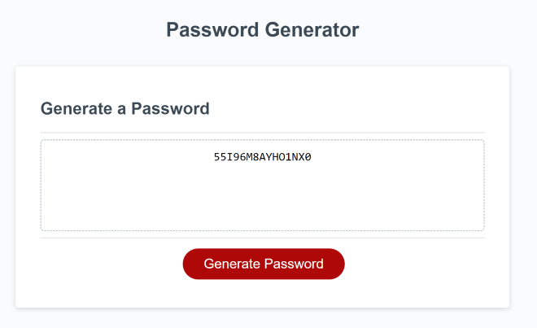
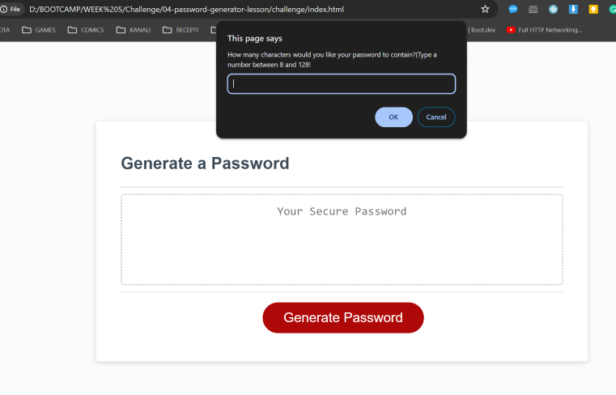
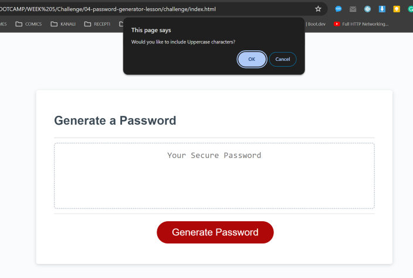

# Password-Generator
A simple web-site, that generates a password, givent the a few choices for the user, like if the password needs to contain lower cases, upper cases, special charachters or numbers. It also asks the user for the length of the password desired.

## Instructions

Open the index.html into your browser and then click the 'Generate Password' button. Then, follow the instructions of the prompts to choose options for your password.

You can find live preview in this link : [Preview](https://joekrstevskigj.github.io/Password-Generator/)

### Screenshot 1 ###
A screenshot of the final password displayed in the box.

### Screenshot 2 ###
A screenshot of the one of the options for the user to generate password.

### Screenshot 3 ###
A screenshot of the an other of the options for the user to generate password.

